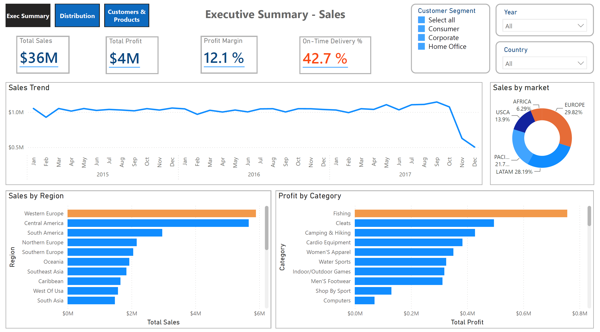
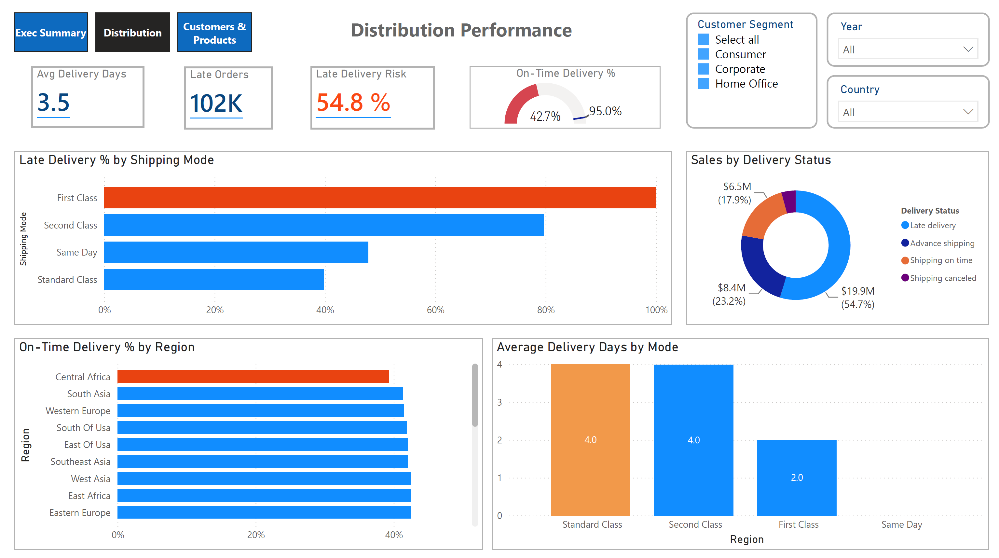
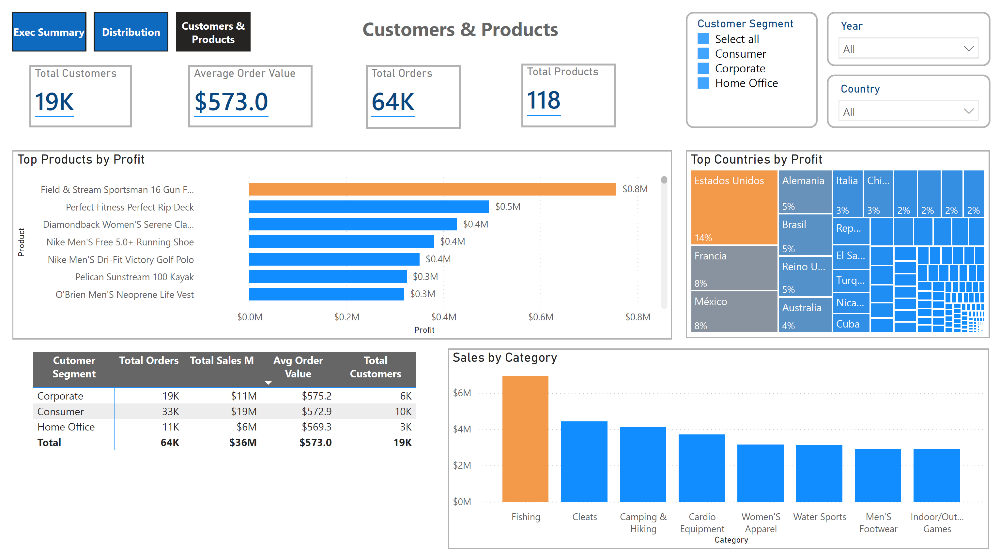
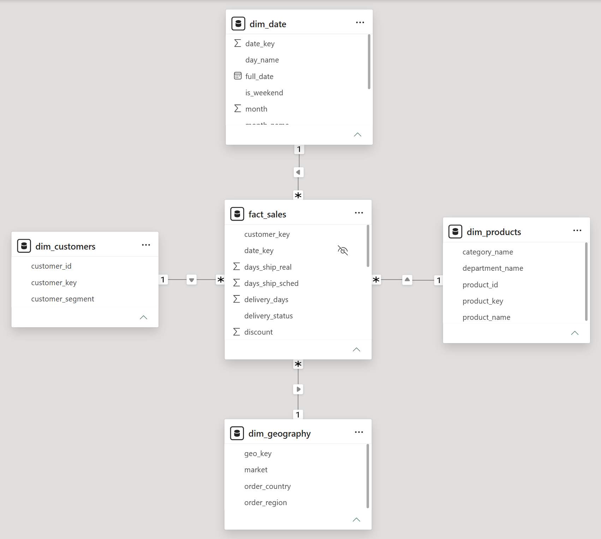

# Supply Chain Analytics Dashboard (Power BI)

An end-to-end supply chain analytics report built in Power BI Desktop on the [DataCo Smart Supply Chain dataset](https://www.kaggle.com/datasets/shashwatwork/dataco-smart-supply-chain-for-big-data-analysis), covering ~180K orders (2015–2017) across sales, delivery performance, customers, and products.

> Built independently for portfolio purposes. I referenced several excellent public analyses for inspiration on metric selection and layout — credited at the bottom of this README.

---

## Dashboard overview

The report has three pages, each answering a different business question.

### 1. Executive Summary — *How is the business performing overall?*




Top-line KPIs (Total Sales, Total Profit, Profit Margin, On-Time Delivery %), sales trend over time, sales by market, and profit by category.

### 2. Distribution Performance — *Where is the network failing on delivery?*




Late delivery risk, average delivery days by mode, on-time delivery by region, and sales by delivery status.

### 3. Customers & Products — *Where does the profit come from, and how concentrated is it?*




Customer segment breakdown, top products by profit, sales by category, and top countries by profit.

---

## Key findings

| Metric | Value | So what |
|---|---|---|
| Total Sales | $36M | Healthy, stable revenue across 3 years |
| Profit Margin | 12.1% | Solid margin |
| **On-Time Delivery** | **42.7%** | **Poor Performance - fewer than half of orders arrive on time** |
| Late Delivery Risk | 54.8% | Lateness is structural, not random |
| Average Delivery Days | 3.5 | Industry benchmark required for comparison |
| Avg Order Value | ~$573 | Consistent across all customer segments |

**Key insight:** the network looks financially healthy but has a systemic delivery problem, with premium shipping modes (First Class, Same Day) being structurally the *most* late. Profit is also heavily concentrated in a few categories (led by Fishing), which warrants a segmentation-driven planning strategy.

Full narrative analysis on Medium: **[link]**

---

## Technical details

- **Tool:** Power BI Desktop
- **Data model:** Star schema with a dedicated date dimension for time intelligence
- **Extract Transform Load:** Performed in Power Query — see [`PowerBI/01-ETL.md`](PowerBI/01-ETL.md)
- **Measures:** Written in DAX — see [`PowerBI/02-dax-measures.md`](PowerBI/02-dax-measures.md)
- **Data model diagram:**


### Reproduce this
1. Download the [DataCo dataset from Kaggle](https://www.kaggle.com/datasets/shashwatwork/dataco-smart-supply-chain-for-big-data-analysis)
2. Open [`Supply_Chain_Analytics_Dashboard.pbix`](Supply_Chain_Analytics_Dashboard.pbix) in Power BI Desktop
3. Update the data source path to your local copy of the dataset

---

## Repo structure

```
├── Supply_Chain_Analytics_Dashboard.pbix   # the report file
├── screenshots/                            # dashboard page images
├── dax/measures.md                         # all DAX measures, documented
├── docs/data-model.png                     # star schema diagram
└── data/README.md                          # link to source dataset
```

---

## References & credits

Built with the DataCo Smart Supply Chain dataset. I studied these public analyses while designing my approach:

- Dinesh Madhavan — [Supply Chain Analytics DataCo Case Study](https://dineshmadhavanportfolio.notion.site/Supply-Chain-Analytics-DataCo-Case-Study-376090be8222813b9009c38984a81e9a) · [GitHub](https://github.com/dinesh-madhavan/supply-chain-analytics-enterprise)
- Babuni Nayak — [Supply Chain Report Power BI](https://www.kaggle.com/code/babuninayak820/supply-chain-report-power-bi/notebook)
- Yannawut — [Data Analysis: Visualize Supply Chain Data using Power BI](https://yannawut.medium.com/data-analysis-visualize-a-supply-chain-data-using-power-bi-51a286f2e60a)

---

## About me

Supply chain professional focused on planning, analytics, and strategy. Connect on [LinkedIn](https://www.linkedin.com/in/tdvende/).
